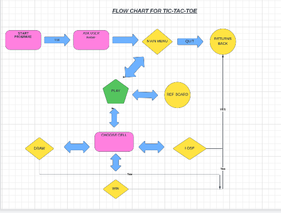
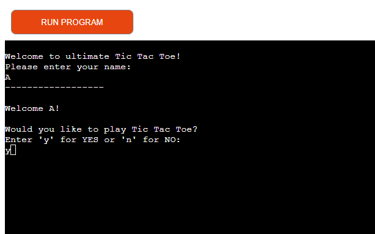
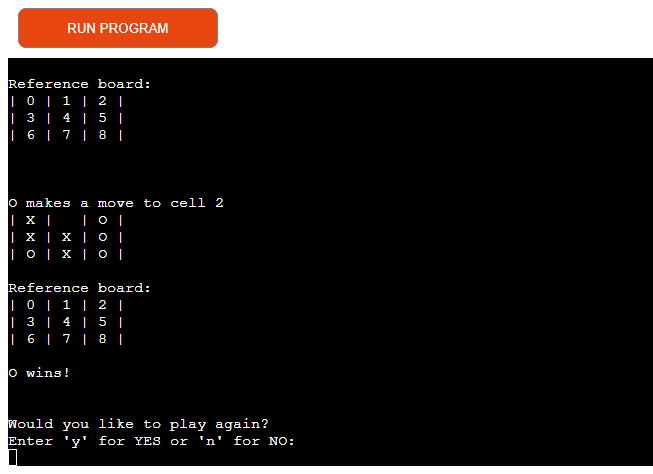
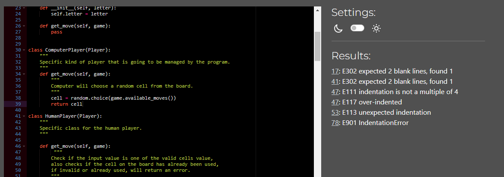

# Portfolio project - 3 Python

# Tic Tac Toe

Tic Tac Toe is a python terminal game, which runs in the Code Institute mock terminal on Heroku

# Introduction

Tic Tac Toe is a game where two players each take turns in choosing either an 'X' or an 'O' in one square of a grid consisting of nine squares, in this case the game is against the computer. The first player who gets 3 of the same letters('X' or 'O') wins the game this is achieved by having the same letters in horizontally, vertically or diagonally.

[Click here for live version of my project](https://p3tic-tac-toe.herokuapp.com/)

[Click here to check my GitHub repository](https://github.com/ankasendo/Tic-Tac-Toe)

# Table of contents
1. [UX](#ux "UX")
    * [User Stories](#userstories "User Stories")
2. [Features](#features)
    * [Run programme](#run-programme)
    * [Name input](#name-input)
    * [Start game](#start-game)
    * [Game over](#game-over)
3. [Technology used](#technology-used)
4. [Testing](#testing)
5. [Bugs](#bugs)
6. [Deployment](#deployemnt)
7. [Credits](#credits)
8. [Acknowledgement](#acknowledgement)

# UX:

## As a player

- I want to play a game with clear and easy instructions
- I want to be able to see my scores
- I want to be able to play the game again or quit easily 

## Flow Chart
To create the structure of the game, this diagram was created using [Lucid Charts](https://www.lucidchart.com/)

# Features

## Run programme
Once the program runs, the user is welcomed to the game and they are asked them to insert their name. I used sleep method so the welcome message appears word by word. The game instructions appear so the user will know how to play the game and also a referecne board so the user will know how to input their chosen letter('X' or 'O').

## Name input
The user will be asked what their name is.

## Start game 
After the user has entered their name a welcome message will appear and it will ask the user to type 'p' to play the game, a loading message will then appear saying 'game starting', the game board will then appear and ready for the user to play. Reference board is kept throughout the game for the purposes of better understaniding of the same. 

## Game over
After the game is ended in a win, lose or a draw, a game over message will appear and it will ask the user if the want play again. 

# Technology used 
* Python
* JavaScript provided in the Code Institute Template
* HTML provided in the Code Institute Template
* GitHub - Version control.
* GitPod - IDE used to code the program and for some of the manual testing.
* Heroku - Program deployment for the users to access it without deploy it themselves.

# Testing
Testing was conducted through out my entire project. Pep8 validator initialy showed some errors, but after few fixes the resullt came back with no issues. Initially, I could not use terminal output, as error was showing up, however, after deployment, and line indentation fixing, it all worked as expected.

# Bugs 
I had a few bugs in my code when playing the game, first one occured right after deployement where error message would show up after clicking 'y' to start the game. The error message reffered to three lines on the code, however the problem was resolved by using PEP8 validator and analising code line by line. 

# Deployment
Steps for deployment:
* Create a new heroku app
* Set the buildbacks to python and nodejs in that order
* Link the heroku app to the repository
* Click on deploy

# Credits 

* Stack Overflow
* [W3 School](https://www.w3schools.com/) helped me with my research and understanding.
* Youtube
* [Am I Responsive](https://ui.dev/amiresponsive) to create the main image for README file.
* [GeekFlare website](https://geekflare.com/tic-tac-toe-python-code/)
* [GeekforGeeks website](https://www.geeksforgeeks.org/python-implementation-automatic-tic-tac-toe-game-using-random-number/)

## Python Libraries Used

* [Random](https://docs.python.org/3/library/random.html)  for computer random moves 
* [Time and Sleep](https://realpython.com/python-sleep/) for text animation / disappearence
* [Sys](https://docs.python.org/3/library/sys.html)  for specific parameters and functions

 # Acknowledgement
 I would like to thank;
 
 * The slack community (https://slack.com/intl/en-ie/https://slack.com/intl/en-ie/) which i can always rely on.
 * I would like to thank the assessment team for taking their time to look over my project, Code institute Tutors and Love Sanwiches guided project.
 * Questions and answers by fellow students on Slack were heavily consulted.

